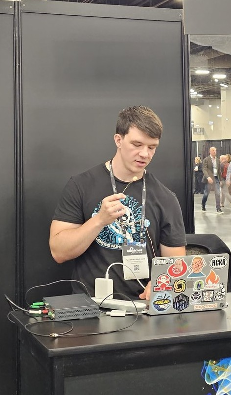

---
# the default layout is 'page'
icon: fas fa-info-circle
order: 4
---

## Who Am I

Hey there! I'm Gunnar Andrews, but on the internet I go by **g0lden**. Dive into my world of **cybersecurity**, **software magic**, and **IT wizardry**. Been at it for about 5 years now, and man, what a ride it's been! 

I currently have a Bachelor's degree in computer engineering where I focused on software development and cybersecurity. I also currently hold an OSCP, OSWA, and OSWE. I love to spend time in the bug bounty community, and I also enjoy building new tools for the community!

### How I Got Into Cyber

I grew up as a gamer, and just like any other young kid back in the day, my accounts got hacked/stolen. I was upset of course, but I was even more curious **HOW** someone was able to do that?! Down the rabbit hole I went. I started messing with small games for fun, and when I went to college I focused on both software and cybersecurity. After leaving college, I got into the offensive security scene as fast as possible and never looked back!

### Stuff I'm Good At

- **CyberSec Stuff:** Mainly into Pentesting, AppSec, all things offensive security. I am mainly focused on web, but have dabbled in mobile, web3, and cloud hacking as well!
- **Dev Shenanigans:** Rocking mainly Python & Go to create automation and scripts that assist myself and other hackers. I love creating software as it provides an extremely enjoyable challenge.
- **IT Adventures:** I love all things operations and infrastructure. I spend a lot of time messing around in the cloud, and also on-premise in my own home lab! Containerization, kubernetes, DevOps, GitOps, and IaC are passions of mine too!

### Things I Swear By

- Never stop learning
- The mind quits far before the body
- Any large goal takes a village!

### What I Do For Fun

If I'm not buried in terminals or code editors, catch me at the gym getting after it, or online somewhere gaming with my friends! I love to play and coach hockey, and nothing feels more like home than the rink. I like to travel as well, and hopefully will be doing more of it going forward.

### Chat With Me

Got a meme to share? Wanna chat about the latest security topic? Or just wanna geek out? Ping me on [LinkedIn](https://www.linkedin.com/in/gunnar-andrews-317995136/) or [Twitter](https://twitter.com/G0LDEN_infosec), or join my [discord](https://discord.gg/BJcDKW4Ke6).
